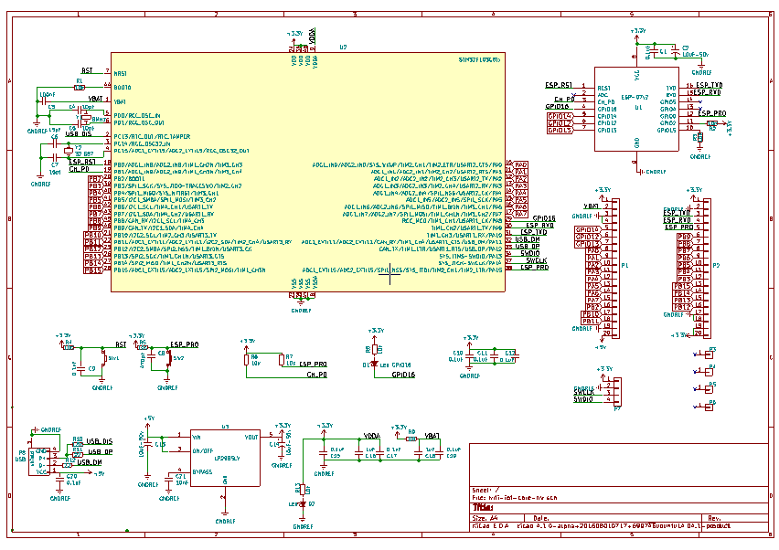
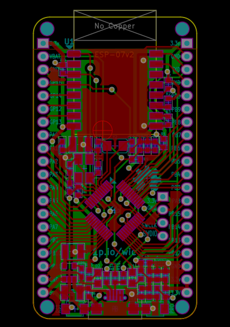
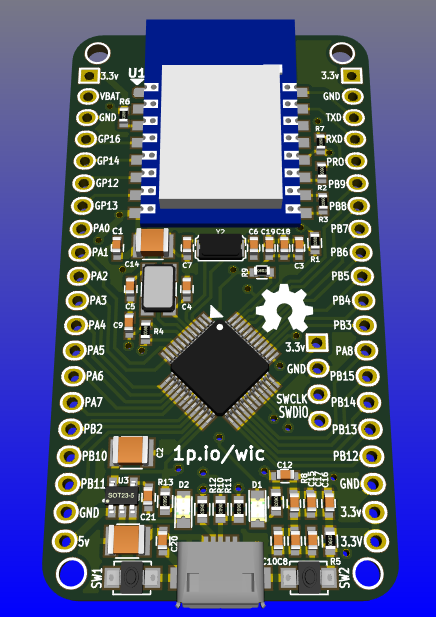

# WIFI-IOT-CORE for IoT production project

_Wifi IoT Core_ project is to combine STM32 + ESP8266.

- ESP8266 is an amazing but cheap wifi chip. However it has many limitions, such as: no USB, limited analog interface, few I/O etc, while applications which are developed on it often need USB-Serial communication. Therefore many ESP8266-based modules in the world are added USB-TTL chip. While this brings some value to developing work, the value is just little in practical use. The design in this _Wifi IoT Core_ project uses the cheap STM32, with USB interface, to ease development, and complements many other features which are missing in ESP8266.

- The _Wifi IoT Core_ project including:

    + [wifi-iot-core-hw](https://github.com/genuine-engineering/wifi-iot-core-hw). Hardware is designed with [KiCad](http://kicad-pcb.org/)
    + [wifi-iot-core-stm32-fw](https://github.com/genuine-engineering/wifi-iot-core-stm32-fw). Firmware for STM32, based on [libopencm3](https://github.com/libopencm3/libopencm3)
    + [wifi-iot-core-esp8266-fw](https://github.com/genuine-engineering/wifi-iot-core-esp8266-fw). Firmware for ESP8266, based on [Espressif SDK 2.0](https://espressif.com/en/support/download/sdks-demos)

# Wifi-iot-core-hw
## Overview
The hardware is designed with [KiCad](http://kicad-pcb.org/) software. It includes two main components: ESP8266 and STM32F103C8T6.

 - STM32 has USB interface and is connected with ESP8266 via UART.

 - The output pins of the STM32 and ESP8266 are exposed for external use.

## Schematic

## PCB

## 3D

## BOM

| Refs                    | Value           | Footprint                                |
|-------------------------|-----------------|------------------------------------------|
| Y1                      | 8MHz            | Crystal:HC49_sm                          |
| C1,C5,C7,C8,C10-C13,C16 | 0.1uF           | Capacitors_SMD:C_0603                    |
| R1,R5,R6                | 10k             | Resistors_SMD:R_0603                     |
| R8                      | 0R              | Resistors_SMD:R_0603                     |
| P3,P5                   | CONN_01X16      | Pin_Headers:Pin_Header_Straight_1x16     |
| P6,P7                   | CONN_01X03      | Pin_Headers:Pin_Header_Straight_1x03     |
| R7,R9-R13               | 10K             | Resistors_SMD:R_0603                     |
| P1                      | USB             | w_conn_pc:conn_usb_B_micro_smd-2         |
| R2,R4                   | 22              | Resistors_SMD:R_0603                     |
| C14,C15                 | 10pF            | Capacitors_SMD:C_0603                    |
| U3                      | ESP-12          | ESP8266:ESP-07v2-smd-16pin               |
| C2,C4,C17               | 10uF-50v        | Capacitors_SMD:C_1210                    |
| D1                      | Led 0805        | LEDs:LED_0805                            |
| U1                      | LP2985LV        | TO_SOT_Packages_SMD:SOT-23-5             |
| R3                      | 1.5K            | Resistors_SMD:R_0603                     |
| P4                      | CONN_01X04      | Pin_Headers:Pin_Header_Straight_1x04     |
| U2                      | STM32F103C8Tx   | Housings_QFP:LQFP-48_7x7mm_Pitch0.5mm    |
| P8-P11                  | CONN_01X01      | Mounting_Holes:MountingHole_3.5mm        |
| SW2                     | SW_PUSH_SMALL_H | Buttons_Switches_SMD:SW_SPST_B3U-1000P-B |
| C3,C6,C9                | 1uF             | Capacitors_SMD:C_0603                    |
| SW1                     | RST             | Buttons_Switches_SMD:SW_SPST_B3U-1000P-B |
| D2                      | Led             | LEDs:LED_0805                            |

## Gerber file

[Wifi IOT Core HW Gerber file](assets/gerber.zip)

## CC-BY license

