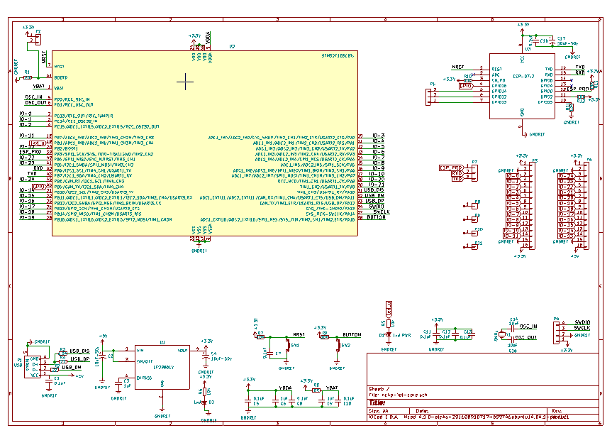
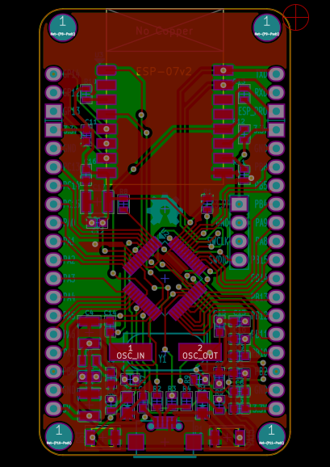
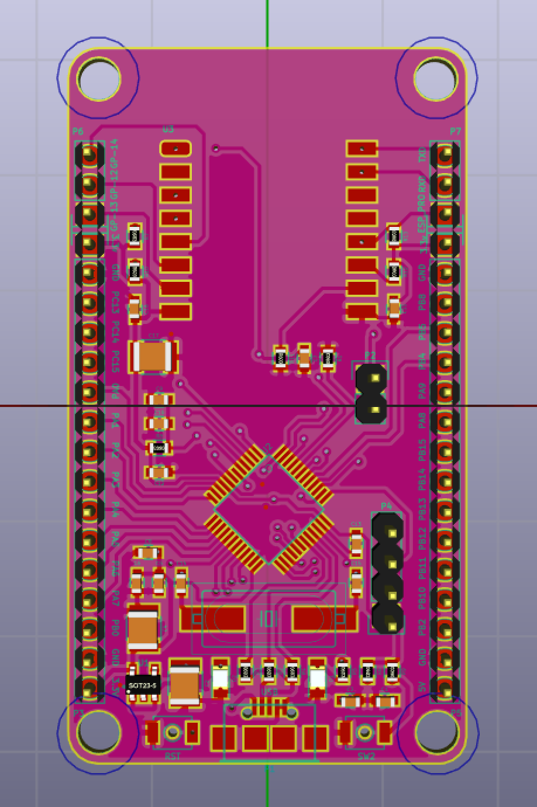

# Information in this iot-core project

IoT Core hardware combined STM32 + ESP8266

- ESP8266 is amazing wifi chip and cheap, however there are many hardware limitions such as: No USB, limit Analog interface, litle bit I/O... 
While applications developing on ESP8266 need to communicate USB-Serial. Therefore many modules in the world are added USB-TTL chip, in addition to develop then the value of little value in practice. This design uses the STM32 cheap, with USB interface, support for development, and many modules there is no shortage of ESP8266.

- The IoT core project including:
    + [iot-core-hw](https://github.com/genuine-engineering/iot-core-hw). Hardware with [KiCad](http://kicad-pcb.org/)
    + [iot-core-stm32-fw](https://github.com/genuine-engineering/iot-core-stm32-fw). STM32-based Firmware [libopencm3](https://github.com/libopencm3/libopencm3)
    + [iot-core-esp8266-fw](https://github.com/genuine-engineering/iot-core-esp8266-fw). ESP8266-based Firmware [Espressif SDK 2.0](https://espressif.com/en/support/download/sdks-demos)

# iot-core-hw
## Overview
The hardware design by [KiCad](http://kicad-pcb.org/) software, includes two main components are ESP8266 and STM32F103C8T6
 - STM32 interface with USB, connect with ESP8266 via UART.
 - The pins of the STM32 and ESP8266 give out.

## Schematic

## PCB

## 3D

## Gerber file 

[IOT Core HW Gerber file](assets/gerber.zip)

## CC-BY license

